# Architecture

이 문서는 ConnectionMultiplexedUDP의 전체 구조, packet 흐름, session lifecycle, thread model만 설명합니다.

개별 파일의 역할은 [FileReference.md](FileReference.md)와 `Docs/Files/` 아래 파일별 문서를 봅니다.

## High-Level Structure

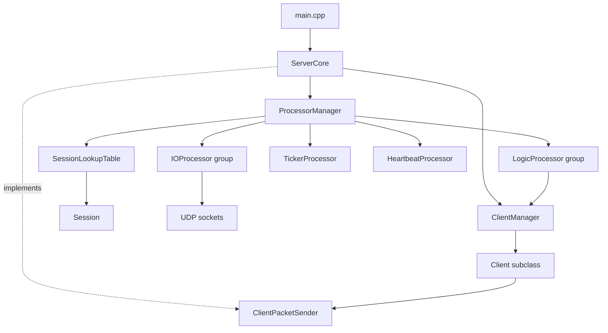

`ServerCore` is the facade. It owns:

- client lifetime through `ClientManager`
- processor lifetime through `ProcessorManager`
- WSA startup/cleanup
- public session registration/removal API

`ProcessorManager` is the coordinator. It owns:

- processor groups
- session lookup table
- authenticated inbound dispatch
- authenticated outbound send path
- timeout/disconnect task scheduling

## Packet Model

UDP datagrams use a two-layer protobuf structure.

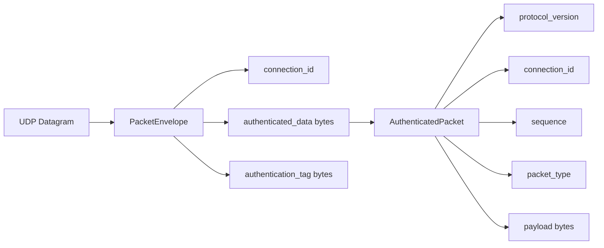

Authentication is computed over serialized `AuthenticatedPacket`.

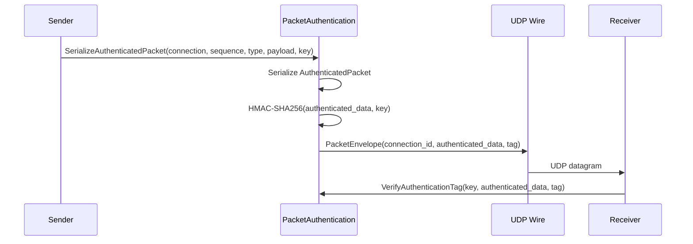

Reserved packet types:

- `HEARTBEAT_PACKET_TYPE = 1`
- `DISCONNECT_PACKET_TYPE = 2`
- application packet types start at `FIRST_APPLICATION_PACKET_TYPE = 1024`

## Inbound Packet Flow

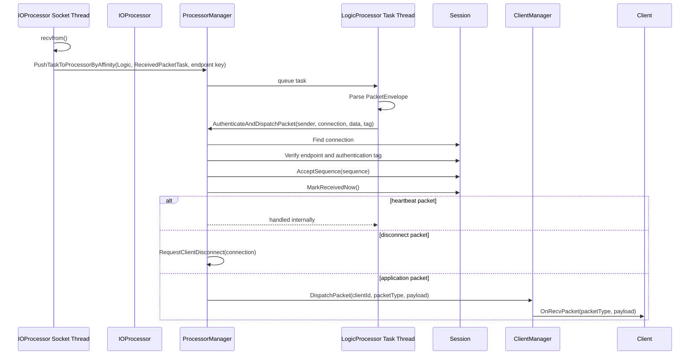

Inbound affinity is based on sender endpoint:

```cpp
(addr.sin_addr.s_addr << 16) | addr.sin_port
```

That keeps packets from the same UDP endpoint biased toward the same Logic processor.

## Outbound Packet Flow

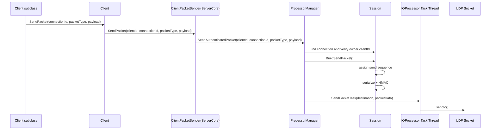

The `Client` layer does not know about `ProcessorManager` directly. `ClientPacketSender` decouples application-level client code from server internals.

## Session Lifecycle

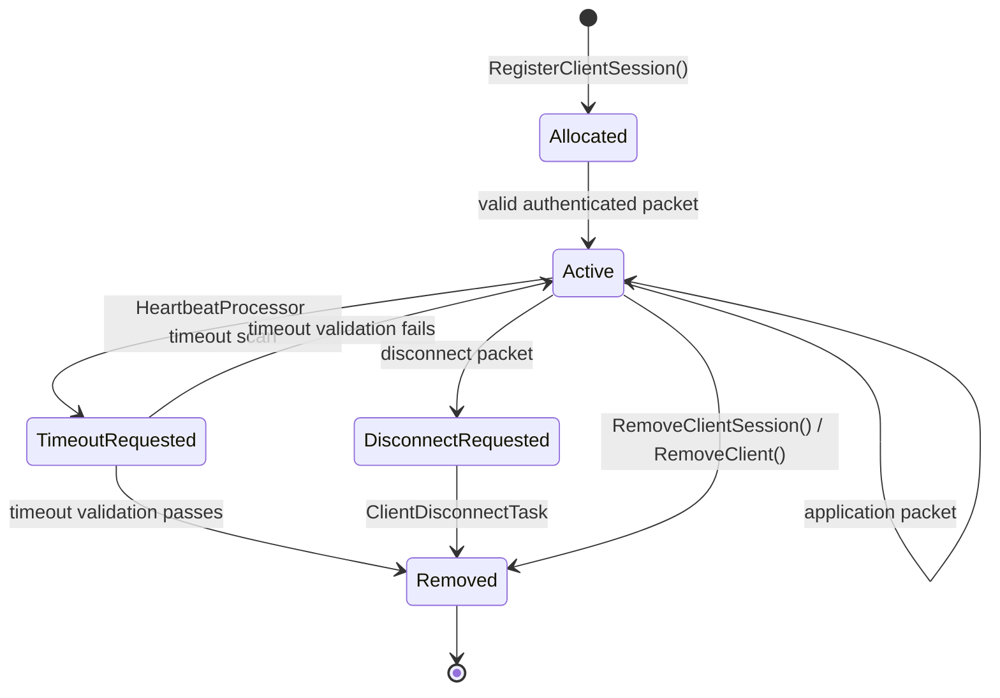

Session identity uses slot index plus generation.

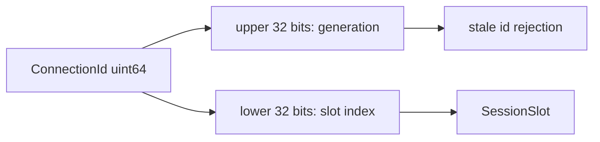

When a session is released, its slot generation is incremented. Old connection ids targeting the same slot fail generation checks.

## Thread Model

Each `ProcessorBase` instance can have up to two worker threads:

- `processorThread`
  - optional long-running thread started by `StartProcessorThread()`
  - examples: IO receive loop, heartbeat scan loop, ticker loop
- `processTaskThread`
  - common task queue worker
  - created for every started processor after `StartImpl()` succeeds

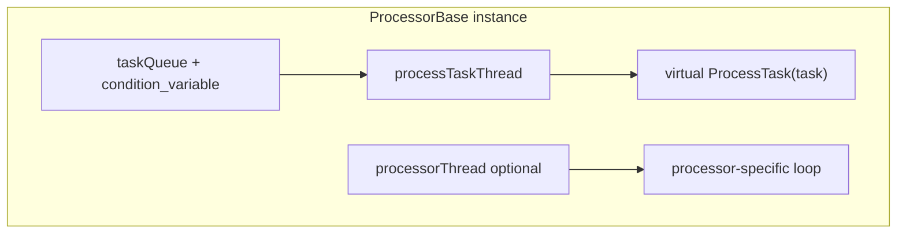

### IOProcessor Threads

For each IO processor:

- processor thread
  - owns receive loop
  - calls `recvfrom()`
  - converts datagrams to `ReceivedPacketTask`
- task thread
  - processes `SendPacketTask`
  - calls `sendto()`

Socket access is protected by `socketMutex`.

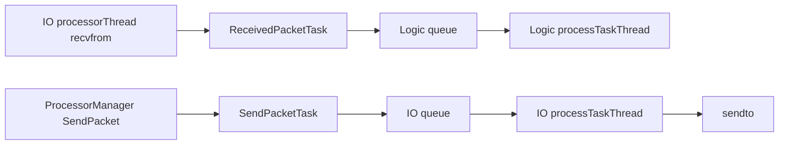

### LogicProcessor Threads

Logic processor currently relies on the common task thread.

It processes:

- `ReceivedPacketTask`
- `ClientDisconnectTask`

It does not start a separate long-running processor thread.

### HeartbeatProcessor Threads

Heartbeat processor uses:

- processor thread
  - sleeps for computed scan interval
  - requests timeout disconnects
- task thread
  - currently unused

Scan interval is computed from session timeout:

- lower bound: 100ms
- upper bound: 1000ms
- target: timeout / 2

### TickerProcessor Threads

Ticker processor uses:

- processor thread
  - wakes by tick interval
  - fires due callbacks
- task thread
  - receives and queues `TickerTask`

Ticker is available as a scheduler foundation but is not yet central to the session flow.

## Lifecycle Ordering

Start order:

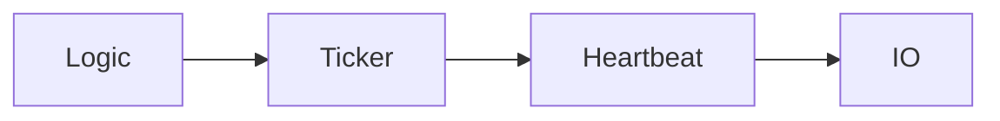

Rationale:

- Logic should be ready before IO starts receiving datagrams.
- Heartbeat should start before IO accepts traffic so session timeout maintenance is available.

Stop order:

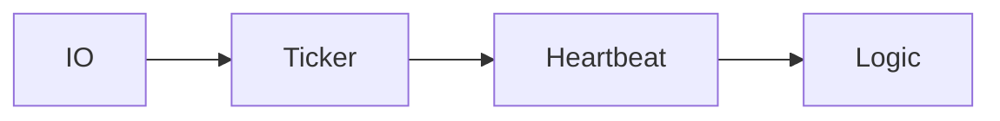

Rationale:

- Stop IO first to stop new inbound network traffic.
- Stop background schedulers next.
- Stop Logic last so queued disconnect/received tasks have the best chance to drain.

## Synchronization Summary

| Component | Protected State | Mechanism |
| --- | --- | --- |
| `ServerCore` | lifecycle state | `lifecycleMutex` |
| `ServerCore` | client/session external operations | `clientSessionMutex` |
| `ClientManager` | client map | `clientsMutex` |
| `ClientManager::ClientEntry` | one-client visit/removal state | entry mutex + condition variable |
| `ProcessorBase` | processor lifecycle | `lifecycleMutex`, atomic state |
| `ProcessorBase` | task queue | `messageQueueMutex`, condition variable |
| `IOProcessor` | UDP socket handle | `socketMutex` |
| `Session` | replay window | `replayMutex` |
| `Session` | last received time | `activityMutex` |
| `Session` | send sequence | `sendMutex` |
| `SessionLookupTable` | session slots/free indices | `slotsMutex` |
| `TickerProcessor` | scheduled task queue | `tickerTaskQueueMutex` |

## Control Packet Handling

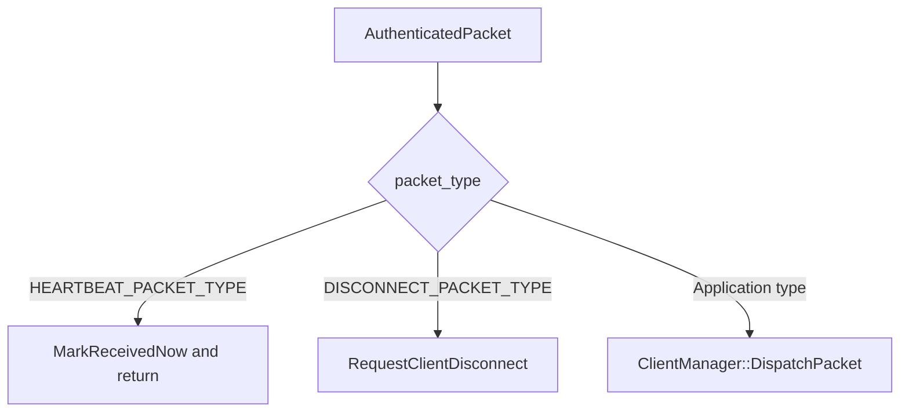

Control packets are consumed internally and are not forwarded to `Client::OnRecvPacket()`.

## Smoke Test Coverage

`ConnectionMultiplexedUDP.exe --smoke-test` covers:

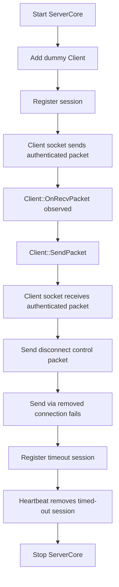

This is an integration smoke test, not a full unit test suite.

## Known Gaps

- No explicit handshake/key exchange protocol exists yet.
- Session registration is currently server API driven.
- Ticker infrastructure exists but is not integrated into session management.
- Runtime diagnostics are mostly `std::cout`/`std::cerr`; structured logging does not exist yet.
