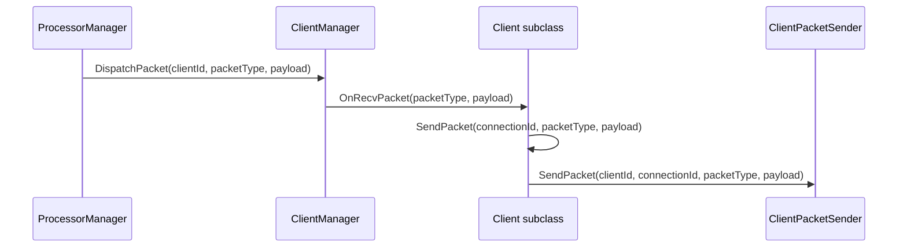

# Client

Covered files:

- `ConnectionMultiplexedUDP/ConnectionMultiplexedUDP/Client.h`
- `ConnectionMultiplexedUDP/ConnectionMultiplexedUDP/Client.cpp`
- `ConnectionMultiplexedUDP/ConnectionMultiplexedUDP/ClientPacketSender.h`

## Role

`Client` is the application-facing base class. Users subclass it and override `OnRecvPacket()` to receive application packets.

`ClientPacketSender` is a narrow interface that lets `Client` request outbound sends without depending directly on `ServerCore` or `ProcessorManager`.

## Receive And Send Paths

## Important Behavior

- `ClientManager` assigns `ClientId` and sender pointer.
- `Client::SendPacket()` validates that the client has a sender and a valid id before delegating.
- `OnRecvPacket()` only receives application packet types; control packets are consumed internally.

## Threading Notes

`OnRecvPacket()` is called from a Logic processor task thread. Client implementations must treat callbacks as multi-threaded entry points unless the server is configured with only one logic processor and one endpoint affinity path.
