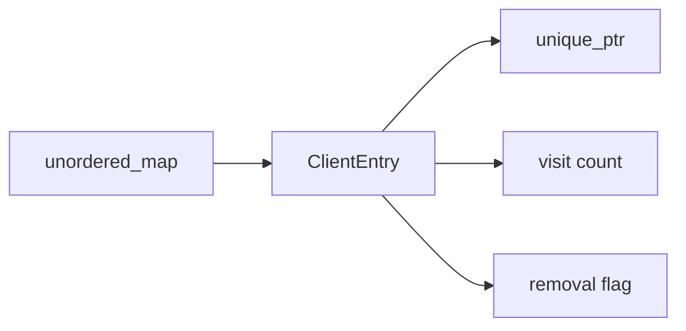
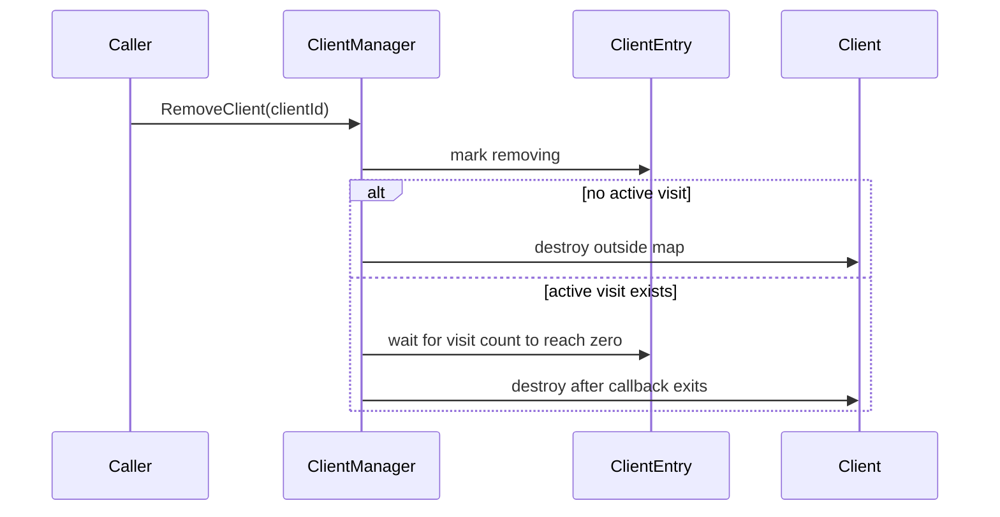

# ClientManager

Covered files:

- `ConnectionMultiplexedUDP/ConnectionMultiplexedUDP/ClientManager.h`
- `ConnectionMultiplexedUDP/ConnectionMultiplexedUDP/ClientManager.cpp`

## Role

`ClientManager` owns registered `Client` objects and dispatches received application packets to the correct client instance.

## Data Model

## Main Responsibilities

- Allocate client ids.
- Store client ownership.
- Dispatch packets to `Client::OnRecvPacket()`.
- Remove clients without destroying an object while a callback is visiting it.

## Removal Flow

## Threading Notes

- `clientsMutex` protects the client map.
- Each `ClientEntry` has its own mutex and condition variable for callback/removal coordination.
- Callbacks are invoked without holding the global client map mutex.
