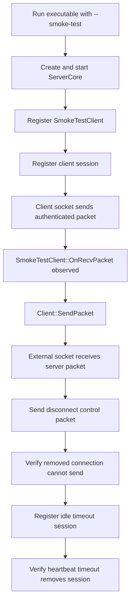

# Entry And Smoke Test

Covered files:

- `ConnectionMultiplexedUDP/ConnectionMultiplexedUDP/main.cpp`
- `ConnectionMultiplexedUDP/ConnectionMultiplexedUDP/SmokeTest.h`
- `ConnectionMultiplexedUDP/ConnectionMultiplexedUDP/SmokeTest.cpp`

## Role

`main.cpp` is the executable entry point. It either runs the smoke test when `--smoke-test` is passed, or starts a simple server runtime.

`SmokeTest` is an integration-level sanity check for the implemented runtime path. It is not a full unit test suite.

## Smoke Test Flow

## Important Behavior

- Uses localhost UDP sockets.
- Builds authenticated packets with the same protocol path used by the server.
- Verifies inbound dispatch, outbound send, disconnect handling, and heartbeat timeout removal.

## Threading Notes

The smoke test starts the real processor threads through `ServerCore`. Test waiting is timeout-based, so failures should terminate instead of hanging indefinitely.
