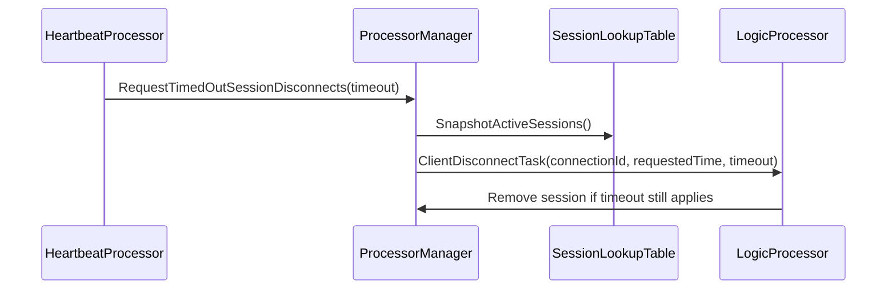

# HeartbeatProcessor

Covered files:

- `ConnectionMultiplexedUDP/ConnectionMultiplexedUDP/HeartbeatProcessor.h`
- `ConnectionMultiplexedUDP/ConnectionMultiplexedUDP/HeartbeatProcessor.cpp`

## Role

`HeartbeatProcessor` periodically scans active sessions and requests disconnect processing for sessions that have not received packets within the configured timeout.

## Timeout Flow

## Important Behavior

- Scan interval is clamped between 100ms and 1000ms.
- Timeout removal is requested through a task instead of removing directly from the heartbeat thread.
- The disconnect task revalidates timeout state before removing a session.

## Threading Notes

Heartbeat scanning runs on the processor thread. The common task thread exists through `ProcessorBase`, but this processor currently has no meaningful task handling.
