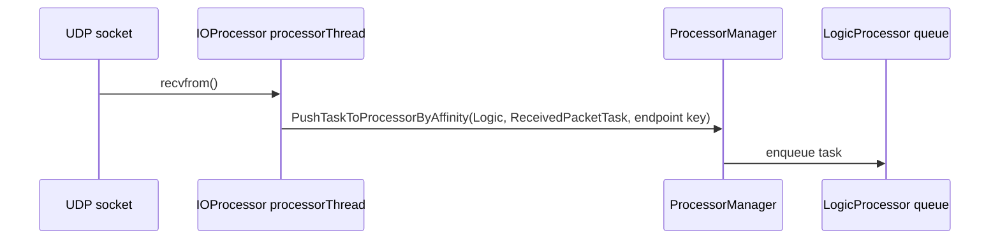
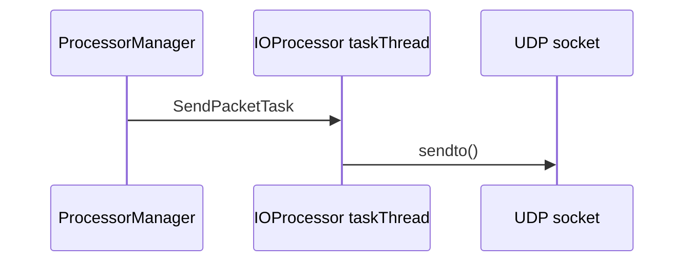

# IOProcessor

Covered files:

- `ConnectionMultiplexedUDP/ConnectionMultiplexedUDP/IOProcessor.h`
- `ConnectionMultiplexedUDP/ConnectionMultiplexedUDP/IOProcessor.cpp`

## Role

`IOProcessor` owns one UDP socket. Its processor thread receives datagrams, and its task thread sends queued packets.

## Receive Flow

## Send Flow

## Important Behavior

- Uses receive timeout behavior through `SO_RCVTIMEO`.
- Computes endpoint affinity from sender IP and port.
- Converts received datagrams into `ReceivedPacketTask`.
- Processes `SendPacketTask` for outbound UDP sends.

## Threading Notes

The UDP socket handle is shared by receive and send paths, so socket access is protected by `socketMutex`.
