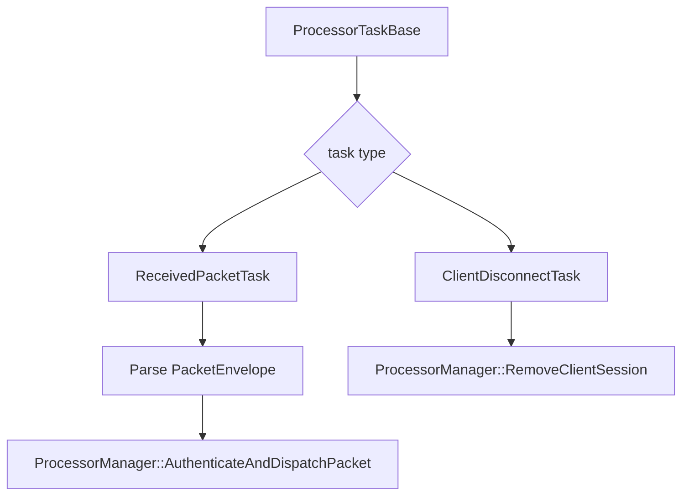

# LogicProcessor

Covered files:

- `ConnectionMultiplexedUDP/ConnectionMultiplexedUDP/LogicProcessor.h`
- `ConnectionMultiplexedUDP/ConnectionMultiplexedUDP/LogicProcessor.cpp`

## Role

`LogicProcessor` handles tasks that require protocol parsing or session/client state decisions.

## Task Flow

## Main Responsibilities

- Parse incoming `PacketEnvelope` data from `ReceivedPacketTask`.
- Forward authenticated packet data to `ProcessorManager`.
- Process client disconnect and timeout disconnect tasks.
- Validate timeout disconnect requests against the current session activity time.

## Threading Notes

`LogicProcessor` uses the common task thread from `ProcessorBase`. It does not start a separate long-running processor thread.
