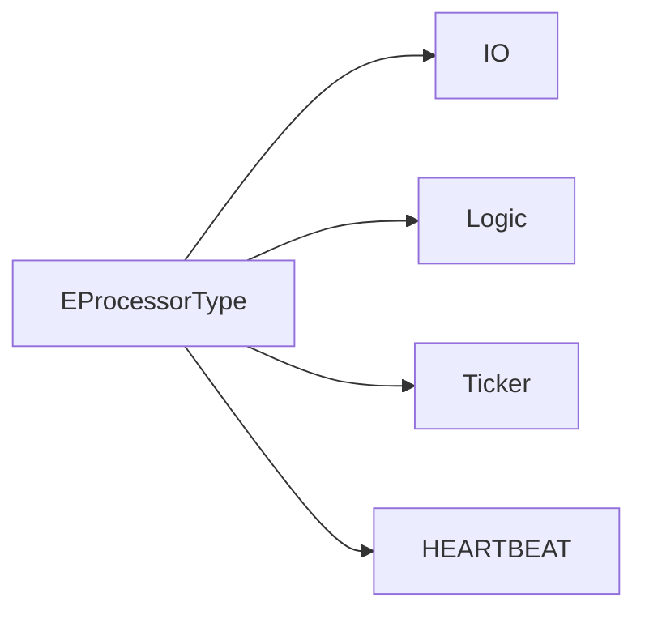
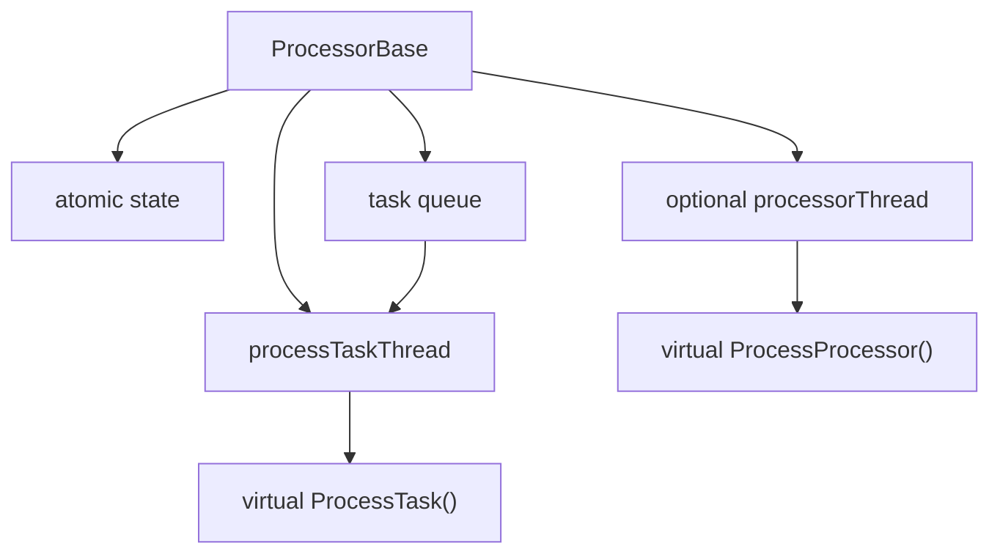

# ProcessorBase

Covered files:

- `ConnectionMultiplexedUDP/ConnectionMultiplexedUDP/ProcessorBase.h`
- `ConnectionMultiplexedUDP/ConnectionMultiplexedUDP/ProcessorBase.cpp`
- `ConnectionMultiplexedUDP/ConnectionMultiplexedUDP/ProcessorType.h`
- `ConnectionMultiplexedUDP/ConnectionMultiplexedUDP/ProcessorTaskBase.h`

## Role

`ProcessorBase` is the common execution base for all processor types. It provides lifecycle management and a task queue worker.

## Processor Types

## Thread Model

## Main Responsibilities

- Start and stop processor lifecycle.
- Own the common queued task worker.
- Provide an optional long-running processor thread hook.
- Expose queue size for load-based scheduling.

## Threading Notes

- `lifecycleMutex` serializes start/stop.
- `messageQueueMutex` and condition variable protect task queue access.
- Processor-specific state is handled by derived classes.
