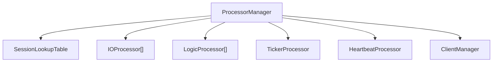
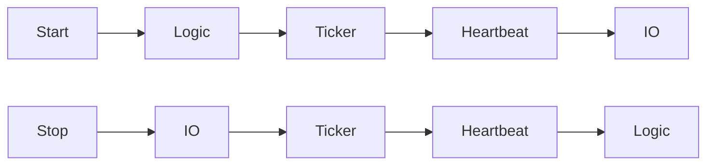

# ProcessorManager

Covered files:

- `ConnectionMultiplexedUDP/ConnectionMultiplexedUDP/ProcessorManager.h`
- `ConnectionMultiplexedUDP/ConnectionMultiplexedUDP/ProcessorManager.cpp`

## Role

`ProcessorManager` coordinates processor groups, session lookup, authenticated packet dispatch, outbound send scheduling, and timeout disconnect requests.

## Owned Runtime

## Main Responsibilities

- Create and start processor groups.
- Push tasks by explicit processor index, least-busy processor, or affinity key.
- Authenticate inbound packets and dispatch application payloads.
- Build outbound authenticated packets and queue them to IO processors.
- Request disconnect processing for explicit disconnects and heartbeat timeouts.

## Start And Stop Order

Logic starts before IO so inbound packets have a processing target. IO stops first so new network traffic stops entering the system during shutdown.

## Threading Notes

`ProcessorManager` is called from multiple processor threads. Shared session state is delegated to `SessionLookupTable` and `Session`, while lifecycle state uses an atomic state value.
