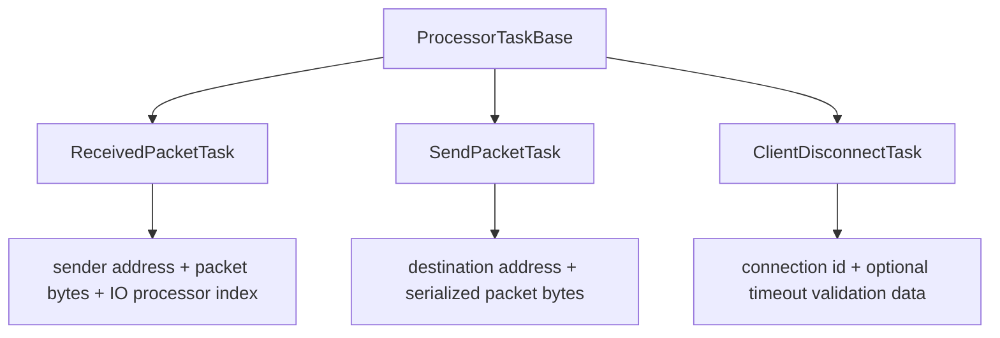

# Processor Tasks

Covered files:

- `ConnectionMultiplexedUDP/ConnectionMultiplexedUDP/ReceivedPacketTask.h`
- `ConnectionMultiplexedUDP/ConnectionMultiplexedUDP/SendPacketTask.h`
- `ConnectionMultiplexedUDP/ConnectionMultiplexedUDP/ClientDisconnectTask.h`

## Role

Processor tasks are small value-carrying objects moved through processor queues.

## Task Types

## Usage

- `ReceivedPacketTask` is produced by `IOProcessor` receive loops and consumed by `LogicProcessor`.
- `SendPacketTask` is produced by `ProcessorManager` outbound send logic and consumed by `IOProcessor`.
- `ClientDisconnectTask` is produced by control packet handling or heartbeat timeout scanning and consumed by `LogicProcessor`.

## Threading Notes

Tasks copy the data they need before entering a processor queue. That keeps queued work independent from the lifetime of the original socket buffer or caller-owned payload.
