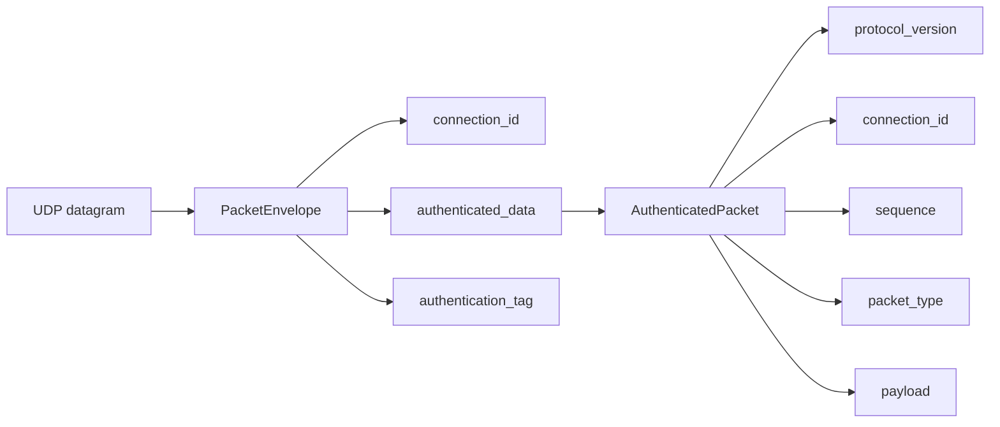
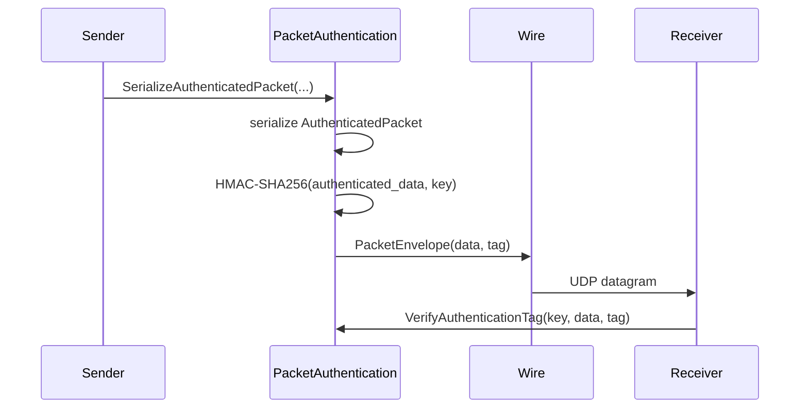

# Protocol

Covered files:

- `ConnectionMultiplexedUDP/ConnectionMultiplexedUDP/Protocol/PacketProtocol.h`
- `ConnectionMultiplexedUDP/ConnectionMultiplexedUDP/Protocol/PacketEnvelope.proto`
- `ConnectionMultiplexedUDP/ConnectionMultiplexedUDP/Protocol/PacketAuthentication.h`
- `ConnectionMultiplexedUDP/ConnectionMultiplexedUDP/Protocol/PacketAuthentication.cpp`
- generated protobuf files under `ConnectionMultiplexedUDP/ConnectionMultiplexedUDP/Generated/`

## Role

The protocol layer defines packet constants, protobuf wire structures, and HMAC-SHA256 packet authentication helpers.

## Packet Shape

## Constants

| Constant | Meaning |
| --- | --- |
| `CURRENT_PROTOCOL_VERSION` | Current packet protocol version. |
| `MAX_PACKET_SIZE` | Maximum accepted packet size. |
| `AUTHENTICATION_KEY_SIZE` | HMAC key size in bytes. |
| `AUTHENTICATION_TAG_SIZE` | HMAC-SHA256 tag size in bytes. |
| `HEARTBEAT_PACKET_TYPE` | Internal heartbeat control packet. |
| `DISCONNECT_PACKET_TYPE` | Internal disconnect control packet. |
| `FIRST_APPLICATION_PACKET_TYPE` | First packet type forwarded to clients. |

## Authentication Flow

## Generated Files

Generated protobuf files are treated as protocol artifacts, not handwritten source. They should be regenerated from `PacketEnvelope.proto` when the protobuf schema changes.
