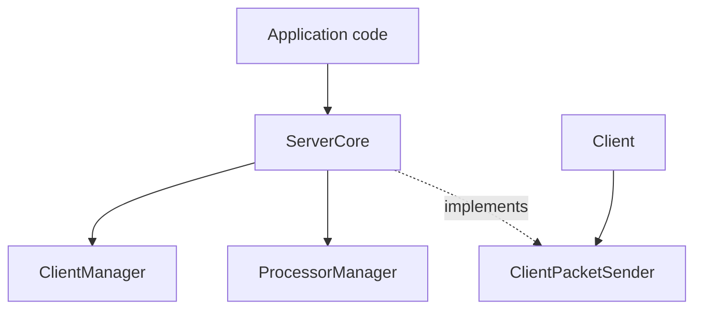
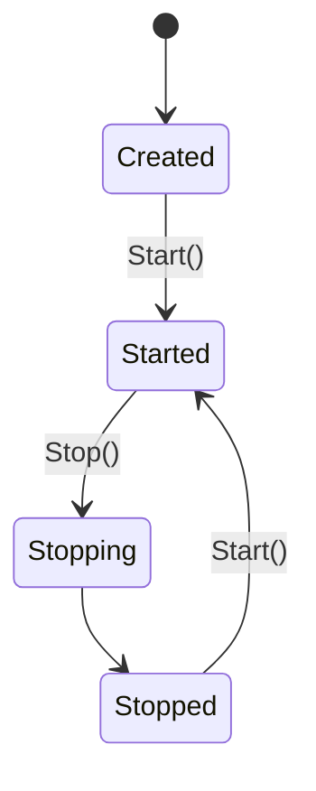

# ServerCore

Covered files:

- `ConnectionMultiplexedUDP/ConnectionMultiplexedUDP/ServerCore.h`
- `ConnectionMultiplexedUDP/ConnectionMultiplexedUDP/ServerCore.cpp`

## Role

`ServerCore` is the public facade for the runtime. It owns the client registry, processor manager, WSA lifecycle, and the public APIs used to add clients, register sessions, remove sessions, and send packets from client code.

## Main Responsibilities

- Initialize and clean up Winsock.
- Start and stop processor groups.
- Add and remove `Client` instances.
- Register and remove authenticated UDP sessions.
- Implement `ClientPacketSender::SendPacket` for `Client::SendPacket`.

## Lifecycle

## Threading Notes

- `lifecycleMutex` protects start/stop state transitions.
- `clientSessionMutex` serializes external client/session operations that must stay consistent across `ClientManager` and `ProcessorManager`.
- Packet processing itself is delegated to processor threads.
