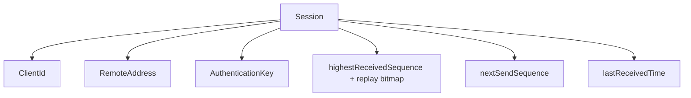
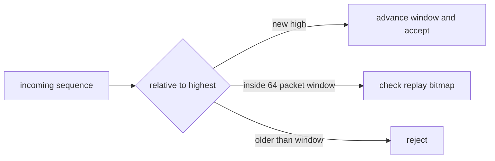

# Session

Covered files:

- `ConnectionMultiplexedUDP/ConnectionMultiplexedUDP/ConnectionId.h`
- `ConnectionMultiplexedUDP/ConnectionMultiplexedUDP/Session.h`
- `ConnectionMultiplexedUDP/ConnectionMultiplexedUDP/Session.cpp`

## Role

`Session` stores one authenticated UDP relationship between a client id and a remote endpoint.

`ConnectionId` is a `uint64_t` handle used to address a session. The lookup table encodes slot index and generation into it.

## Session State

## Main Responsibilities

- Verify that packets come from the expected UDP endpoint.
- Verify HMAC authentication tags through the protocol layer.
- Reject replayed or too-old sequence numbers.
- Track last received time for heartbeat timeout.
- Build authenticated outbound packet envelopes.

## Replay Window

## Threading Notes

- `replayMutex` protects replay-window mutation.
- `sendMutex` protects outbound sequence allocation.
- `activityMutex` protects last-received timestamp reads/writes.
