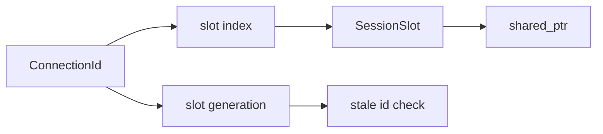

# SessionLookupTable

Covered files:

- `ConnectionMultiplexedUDP/ConnectionMultiplexedUDP/SessionLookupTable.h`
- `ConnectionMultiplexedUDP/ConnectionMultiplexedUDP/SessionLookupTable.cpp`

## Role

`SessionLookupTable` owns session slots and maps `ConnectionId` values to active `Session` instances.

## Slot Model

## Main Responsibilities

- Allocate sessions into reusable slots.
- Reject stale connection ids by checking generation.
- Release one session by connection id.
- Release all sessions for a client id.
- Produce active session snapshots for heartbeat scanning.

## Threading Notes

`slotsMutex` protects slot storage, free indices, generation changes, and active snapshots. Returned `shared_ptr<Session>` instances keep sessions alive while processing continues outside the table lock.
