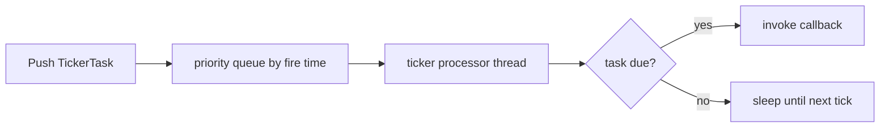

# TickerProcessor

Covered files:

- `ConnectionMultiplexedUDP/ConnectionMultiplexedUDP/TickerProcessor.h`
- `ConnectionMultiplexedUDP/ConnectionMultiplexedUDP/TickerProcessor.cpp`
- `ConnectionMultiplexedUDP/ConnectionMultiplexedUDP/TickerTask.h`

## Role

`TickerProcessor` is a simple scheduled callback processor. It can receive `TickerTask` instances and fire their callbacks after the requested time.

## Scheduling Flow

## Main Responsibilities

- Store scheduled tasks in fire-time order.
- Wake periodically using the configured tick interval.
- Execute callbacks that are due.

## Threading Notes

`tickerTaskQueueMutex` protects the scheduled task queue. Callback code runs on the ticker processor thread and should avoid blocking long enough to delay later scheduled work.
